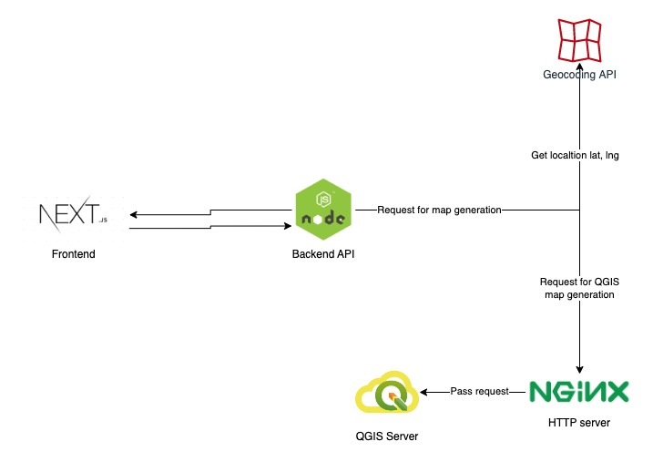

# Contributing to Mapogram

:+1::tada: First off, thanks for taking the time to contribute! :tada::+1:

The following is a set of guidelines for contributing to Mapogram and its packages, which are hosted in the [Slash Digital Repo](https://github.com/slashdigital/) on GitHub. These are mostly guidelines, not rules. Use your best judgment, and feel free to propose changes to this document in a pull request.

## Code of Conduct

This project and everyone participating in it is governed by the [Mapogram Code of Conduct](CODE_OF_CONDUCT.md). By participating, you are expected to uphold this code. Please report unacceptable behavior to [mapogram@slash.co](mailto:mapogram@slash.co).

## What should I know before I get started?

- [Node.JS](https://nodejs.org)
- [Docker](https://www.docker.com)
- [QGIS](https://www.qgis.org)

In this project, we use:
- `frontend` and `backend api` for serving web application
- `QGIS server` is used to open QGIS project and generate flood information on specify area
- `nginx`: to serve http request which required for QGIS Server
- `Geocoding`: to get latitude and longitude from google api

## How Can I Contribute?

If you want to contribute about using Mapogram, please do the folllwing:

- Raise the issue in Github issue tab
- If you would like to make changes, please fork and make the pull request. See the [pull request template](PULL_REQUEST.md)

## Styleguides

### Git Commit Messages

* Use the present tense ("Add feature" not "Added feature")
* Use the imperative mood ("Move cursor to..." not "Moves cursor to...")
* Limit the first line to 72 characters or less
* Reference issues and pull requests liberally after the first line
* When only changing documentation, include `[ci skip]` in the commit title
* Consider starting the commit message with an applicable emoji:
    * :art: `:art:` when improving the format/structure of the code
    * :racehorse: `:racehorse:` when improving performance
    * :non-potable_water: `:non-potable_water:` when plugging memory leaks
    * :memo: `:memo:` when writing docs
    * :penguin: `:penguin:` when fixing something on Linux
    * :apple: `:apple:` when fixing something on macOS
    * :checkered_flag: `:checkered_flag:` when fixing something on Windows
    * :bug: `:bug:` when fixing a bug
    * :fire: `:fire:` when removing code or files
    * :green_heart: `:green_heart:` when fixing the CI build
    * :white_check_mark: `:white_check_mark:` when adding tests
    * :lock: `:lock:` when dealing with security
    * :arrow_up: `:arrow_up:` when upgrading dependencies
    * :arrow_down: `:arrow_down:` when downgrading dependencies
    * :shirt: `:shirt:` when removing linter warnings

## Additional Notes

### Issue and Pull Request Labels

This section lists the labels we use to help us track and manage issues and pull requests. Most labels are used across all Mapogram repositories, but some are specific to `mapogram`.

Github Issue tab makes it easy to use labels for finding groups of issues or pull requests you're interested in. For example, you might be interested in open issues across `mapogram`  which are labeled as bugs, but still need to be reliably reproduced  or perhaps open pull requests in `mapogram` which haven't been reviewed yet. To help you find issues and pull requests, each label is listed with search links for finding open items with that label in `mapogram` only and also across all Mapogram repositories.

The labels are loosely grouped by their purpose, but it's not required that every issue has a label from every group or that an issue can't have more than one label from the same group.

Please open an issue on `mapogram` if you have suggestions for new labels, and if you notice some labels are missing on some repositories, then please open an issue on that repository.
